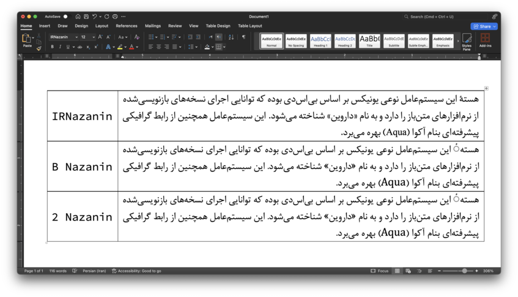

# Fixed Persian Fonts

Most free Persian fonts do not fully comply with the TrueType/OpenType standards. Consequently, they may not display correctly in Microsoft Office for Mac, leading to inconsistencies when a document is viewed on Windows and Mac. This repository resolves these issues by fixing Persian fonts to ensure consistent rendering across both platforms. Before copying the corrected fonts, make sure to completly remove any existing versions of the old fonts.

**Note:** This repo doesn't aim to fix other issues that these fonts have.

The following screenshot shows the use of fixed fonts in Microsoft Word 2024 running on MacOS 15.
